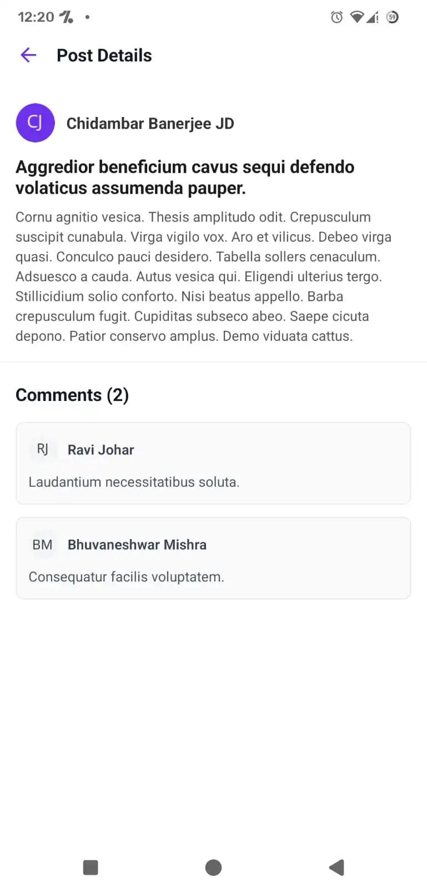

# Hiryo Social App
A social feed mobile application built with React Native (Expo) and TypeScript. This app consumes the GoRest API to display a dynamic feed of posts and allows users to view detailed posts alongside their respective comments.

<p align="center">
  
  
  
</p>

---

## ✨ Features

* **Home Feed:** Displays a scrollable list of posts with dynamic user avatars.
* **Pull-to-Refresh:** Integrated native refresh controls to fetch the latest posts.
* **Post Details:** A seamless, single-scroll page viewing the full post text and a list of associated comments.
* **Dynamic Avatars:** Auto-generates user initials onto a custom-colored background using the UI-Avatars API.
* **Custom Navigation Header:** Features a custom SVG logo integration directly within the React Navigation stack.

---

## 🛠 Tech Stack

* **Framework:** React Native / Expo (Expo Go)
* **Language:** TypeScript
* **Navigation:** React Navigation
* **Networking:** Axios
* **Assets:** `react-native-svg`

---

## 🧠 Architecture & Technical Decisions

As part of building a robust and scalable application, several architectural decisions were made:

### 1. Component-Based & Service-Oriented Architecture
The project is strictly organized into `screens/`, `components/`, and `services/`. All API calls (via Axios) are abstracted into a dedicated `api.ts` service layer. This ensures the UI components remain clean and only responsible for rendering data, not managing network protocols.

### 2. Handling API Limitations (The N+1 Problem)
The GoRest `/posts` endpoint returns a `user_id`, but lacks the user's name and profile data. To prevent an enormous initial data bottleneck (fetching 20 posts and then waiting to fetch 20 users before rendering the screen), I implemented **lazy-loading at the component level**.
* The `HomeScreen` fetches and renders the `PostCard` components immediately.
* Each `PostCard` independently fetches its specific user's details on mount.
* Added a **fallback state**: If a user is deleted from the GoRest database, the app gracefully catches the error and generates a fallback user (e.g., "User #3215") rather than crashing.

### 3. Smooth Scrolling (FlatList Optimization)
On the Post Details screen, instead of placing the main Post inside a standard `<View>` above the comments (which breaks native scrolling), the main post is rendered inside the `<FlatList>` using the `ListHeaderComponent` prop. This ensures the entire screen, including the post and comments, scrolls together seamlessly.

### 4. Strict TypeScript Typing
Defined strict interfaces in `src/types/index.ts` to ensure type safety across API responses and React Navigation route parameters.

---

## 📂 Folder Structure

```text
SocialApp/
├── App.tsx                 # Navigation wrapper and Entry Point
├── assets/                 # SVGs and static files
└── src/
    ├── components/         # Reusable UI (PostCard, CommentCard)
    ├── screens/            # Full-page views (HomeScreen, PostDetailsScreen)
    ├── services/           # Axios API configuration
    └── types/              # TypeScript interfaces
```

---

## 🔧Installation & Setup
  ### 1. Download & extract the ZIP
  
  ### 2. Open CMD in the folder that contains App.tsx
  
  ### 3. Run the following:-
  ```
  npm install expo
  ```
  ```
  npx expo start
  ```
  you'll see a QR Code appear in your terminal.
  
  ### 4. Download "Expo Go" on your Phone.

  ### 5. Open the app & scan the QR code.

  ### 🎉 CONGRATULATIONS! You're ready to go :D


